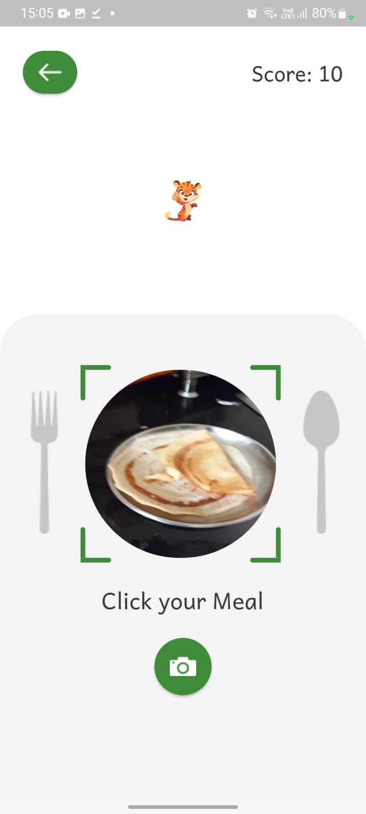
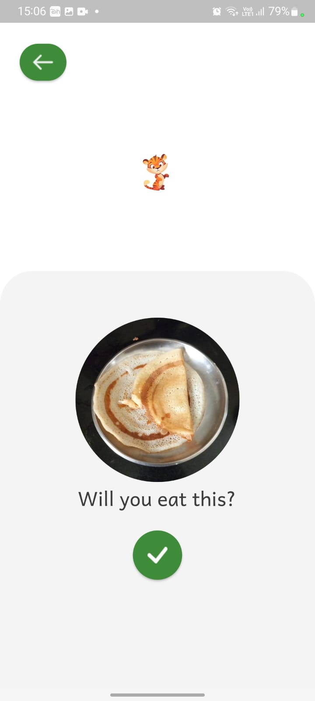

# Hungry Bruno

A proposed solution to the assignment given by Alemeno for internship.
It is a simple app where we need to click images and feed the animal. 
 
I tried to gamify the approach with maintaining score and the size of animal increases each time you feed.

Bonus points covered in my app:
 - Storing the uploaded images to firebase
 - Showing camera preview inside the black circle
 - Sending a notification when the image is uploaded saying “Thank you for sharing
   food with me”
 - Matching the design.

## ScreenShots

<table>
     <tr>
        <td>
            
        </td>
        <td>
            
        </td>
        <td>
            
        </td>
        <td>
            
        </td>
    </tr>
    <tr>
        <td>
            
        </td>
       
   
</table>
                                                                                               
                                                                                                                    
## Features

- Feed the animal by clicking image
- A score is maintained
- Fullscreen mode
- Notifications service
- Camera Service
- Cross platform
 
 
## Tech Stack/Packages used

**Stack:** Flutter

**Cloud service:** Firebase

**Fonts:** Google Fonts

**Notifications:** : Flutter Local Notifications

**State-Management:** : Provider

## Installation

Install the app by downloading the apk uner the releases section here.
    

